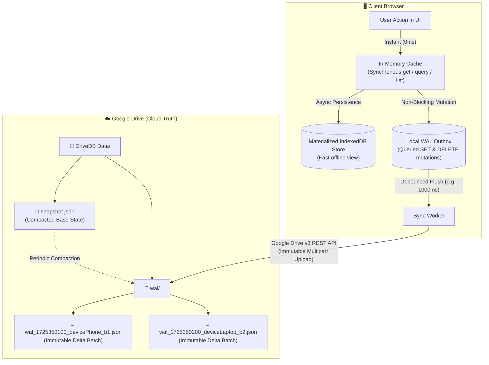

# 🚀 DriveDB

> **Lightweight, local-first, zero-backend database for single-user web applications with IndexedDB caching and Append-Only Delta Log (WAL) Google Drive cloud synchronization.**

[](https://www.npmjs.com/package/@aldian/drivedb)
[](https://opensource.org/licenses/MIT)
[](https://www.typescriptlang.org/)
[]()

---

## 💡 Why DriveDB?

Modern web apps and single-user PWAs face a dilemma:
1. **Set up backend databases** (PostgreSQL, Supabase, Firebase) $\rightarrow$ server costs, maintenance overhead, and storing user personal data on third-party servers.
2. **Browser-only storage** (LocalStorage, IndexedDB) $\rightarrow$ fast and private, but changes are trapped on a single device and vulnerable to cache eviction.
3. **Monolithic cloud file sync** (e.g. uploading a single 10MB `database.json`) $\rightarrow$ severe network bottlenecks, race conditions, and heavy mobile battery drain.

### The DriveDB Solution: **Append-Only Delta Log (WAL)**
DriveDB implements a true database **Write-Ahead Log (WAL)** directly on Google Drive (**Bring Your Own Drive / BYOD**):
* **Zero Latency ($0\text{ms}$)**: Reads and queries resolve synchronously from an in-memory cache.
* **Durable IndexedDB Persistence**: Writes persist asynchronously to local IndexedDB with browser eviction protection (`navigator.storage.persist()`).
* **Append-Only Cloud Sync**: Instead of rewriting a giant file, DriveDB pushes small, immutable delta log batches (`wal/{timestamp}_{clientId}_{batchId}.json`) to Google Drive.
* **Zero Overwrite Conflicts**: Because cloud sync *appends* new immutable files instead of modifying existing files, simultaneous edits on phone and laptop **never collide or overwrite each other**.
* **Automatic Compaction**: Older WAL files are periodically folded into a consolidated `snapshot.json`.

---

## 🏗️ Architecture



---

## ✨ Features

- ⚡ **Zero-Latency ($0\text{ms}$)**: Reads and queries resolve directly from in-memory state.
- 📜 **Append-Only Delta Log (WAL)**: Only sends tiny mutation deltas over the wire instead of re-uploading the entire database.
- 🛡️ **Zero Overwrite Conflicts**: Client syncs append immutable log files. HTTP 412/409 conflicts and race conditions are eliminated.
- 🔄 **Deterministic Replay & LWW**: New remote WAL batches replay in timestamp order with Last-Write-Wins (LWW) conflict convergence.
- 🪦 **Tombstone Deletion**: Deleting records registers a `DELETE` mutation in the WAL, ensuring deletions propagate cleanly across devices.
- 🗜️ **Automatic Snapshot Compaction**: Periodically merges accumulated WAL logs into a single `snapshot.json` and archives old logs.
- 📡 **Cross-Tab Synchronization**: Native `BroadcastChannel` support keeps multiple open tabs in sync without redundant network calls.
- 📦 **1-Click JSON Backup & Restore**: Direct export and import for complete user data sovereignty.
- 🔒 **Direct Client-to-Google Communication**: Zero intermediary servers. 100% of data flows directly between the browser and Google's official API.

---

## 📦 Installation

```bash
npm install @aldian/drivedb
# or
pnpm add @aldian/drivedb
# or
yarn add @aldian/drivedb
```

---

## 🚀 Quick Start

### 1. Initialize DriveDB
```typescript
import { DriveDB } from "@aldian/drivedb";

interface Note {
  title: string;
  content: string;
  tags: string[];
}

// Create and initialize collection
const db = new DriveDB<Note>({
  dbName: "my_notes_app",
  tableName: "notes",
  syncDebounceMs: 1000,
  gdriveFolderName: "My Notes App",
  // Optional: Supply Google OAuth Access Token (or token getter function)
  accessToken: () => localStorage.getItem("gdrive_token"),
});

await db.init();
```

### 2. Fast CRUD Operations
```typescript
// Create or Update (0ms in-memory update + async IndexedDB durability + WAL log)
await db.set("note_1", {
  title: "Meeting Notes",
  content: "Discuss roadmap and launch timeline.",
  tags: ["work", "planning"],
});

// Synchronous 0ms retrieval
const note = db.get("note_1");
console.log(note?.data.title); // "Meeting Notes"

// Query with predicate filters
const workNotes = db.query((doc) => doc.data.tags.includes("work"));

// List all active documents
const allNotes = db.list();

// Delete (registers DELETE mutation in WAL for cloud propagation)
await db.delete("note_1");
```

### 3. Google Drive Sync & Status Listeners
```typescript
// Subscribe to sync status events
const unsubscribe = db.onSyncChange(({ status, error, mutationsSynced }) => {
  console.log(`Sync status: ${status}`); // "pending" | "syncing" | "synced" | "error"
});

// Update Google OAuth token dynamically upon user sign-in
db.setAccessToken(userOAuthAccessToken);

// Trigger manual two-way sync (downloads remote WAL logs & flushes local outbox)
await db.sync();
```

---

## ⚛️ React / Next.js Hook Example

```typescript
import { useState, useEffect } from "react";
import { DriveDB, Document, SyncStatus } from "@aldian/drivedb";

interface Habit {
  name: string;
  streak: number;
}

const habitsDb = new DriveDB<Habit>({
  dbName: "habits_app",
  tableName: "habits",
  accessToken: () => localStorage.getItem("google_access_token"),
});

export function useHabits() {
  const [habits, setHabits] = useState<Document<Habit>[]>([]);
  const [syncStatus, setSyncStatus] = useState<SyncStatus>("synced");

  useEffect(() => {
    async function setup() {
      await habitsDb.init();
      setHabits(habitsDb.list());
    }
    setup();

    return habitsDb.onSyncChange((event) => {
      setSyncStatus(event.status);
      setHabits(habitsDb.list());
    });
  }, []);

  const addHabit = async (id: string, name: string) => {
    await habitsDb.set(id, { name, streak: 0 });
    setHabits(habitsDb.list());
  };

  const deleteHabit = async (id: string) => {
    await habitsDb.delete(id);
    setHabits(habitsDb.list());
  };

  return { habits, addHabit, deleteHabit, syncStatus };
}
```

---

## 📖 API Reference

### `new DriveDB<T>(options?: DriveDbOptions)`

| Option | Type | Default | Description |
| :--- | :--- | :--- | :--- |
| `dbName` | `string` | `"drivedb_store"` | IndexedDB database name |
| `tableName` | `string` | `"documents"` | IndexedDB object store table name |
| `syncDebounceMs` | `number` | `1000` | Milliseconds to debounce before uploading WAL to Google Drive |
| `autoSync` | `boolean` | `true` | Automatically trigger cloud sync on local writes |
| `gdriveFolderName` | `string` | `"DriveDB Data"` | Target folder name in user's Google Drive |
| `walFolderName` | `string` | `"wal"` | Subfolder name for immutable WAL batches |
| `snapshotFileName` | `string` | `"snapshot.json"` | Consolidated snapshot filename |
| `maxUncompactedLogs` | `number` | `50` | Max WAL batches before auto-compaction |
| `enableBroadcastChannel` | `boolean` | `true` | Enable real-time cross-tab updates |
| `requestPersistence` | `boolean` | `true` | Request `navigator.storage.persist()` on initialization |
| `clientId` | `string` | *Auto-generated UUID* | Unique client/device identifier |
| `accessToken` | `string \| (() => string \| null)` | `undefined` | Google OAuth access token or getter function |

---

## 🚢 Release & Publishing Guide

Releases are published directly and securely from your local machine.

### Prerequisites (One-Time)
Ensure you are logged into your npm account in your local terminal:
```bash
npm login
```
Verify authentication:
```bash
npm whoami
# Should output: aldian
```

---

### Step-by-Step Publishing Workflow

#### 1. (Initial Release) Publish Version 0.1.0
If publishing for the first time:
```bash
npm publish --access public
```

#### 2. (Subsequent Updates) Bump Version & Release
For subsequent updates, use semantic versioning:
```bash
# 1. Bump the version in package.json and generate a git tag
npm version patch   # 0.1.0 -> 0.1.1 (Bug fixes / minor adjustments)
# or: npm version minor  # 0.1.0 -> 0.2.0 (New backward-compatible features)
# or: npm version major  # 0.1.0 -> 1.0.0 (Breaking API changes)

# 2. Publish to the public npm registry
npm publish --access public

# 3. Push the version bump commit and git tag to GitHub
git push origin main --follow-tags
```

> **🛡️ Built-in Safety Check (`prepublishOnly`)**:
> The `package.json` includes a `prepublishOnly` lifecycle hook. Whenever you run `npm publish`, npm automatically executes:
> 1. `tsc --noEmit` (TypeScript typecheck)
> 2. `vitest run --coverage` (All 31 tests & 92% coverage threshold)
> 3. `tsup build` (Bundling clean ESM, CJS, and `.d.ts` outputs)
>
> If any test or type error occurs, the publish is aborted immediately, preventing broken builds from reaching npm.

---

## 📄 License

MIT © [Aldian Fazrihady](https://github.com/aldian)
